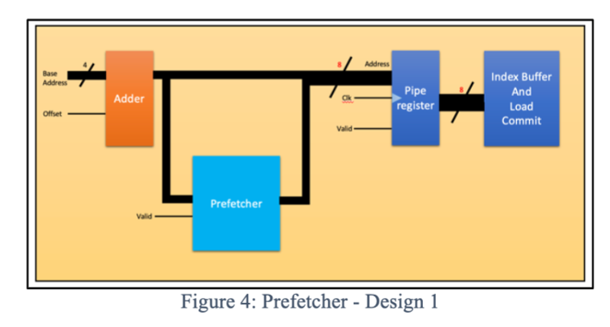

# Assignment #3: How to add a HW prefetcher

In this assignment, you will add a next line prefetcher in the memory system. 
 

 
* The `LSU` unit takes a vector of addresses. It also includes status bits like read and valid bit for each of the threads. The `LSU` unit starts with an adder that adds the offset to each of the base addresses and computes the address of load/store. 

[comment]: <> (Please note that the addresses are computed for even inactive threads. For an inactive thread, the valid bit is false. The offset is an immediate value. Since the address is in the critical path, the processor sends the computed address into a pipeline latch.) 

[comment]: <> (The metadata associated with the instruction has to be stored somewhere so that we can track the requests sent to the dcache and the responses and data sent from the dcache. For this purpose, the processor has an index buffer. For every instruction, the processor puts the metadata in the index buffer and gets a tag. The tag is sent as a part of the D-cache request and will be present in its D-cache response as well. When a response arrives, the processor retrieves the metadata from the index buffer using the tag and pipelines the responses with the instruction metadata to the commit stage )
Prefetch address: every time a load address is computed, the prefetcher generates the next cache line address shown in Figure 4 and sends it to the d-cache. 

The processor generates memory addresses and inserts the new memory address into 
`VX_pipe_register`. Since `VX_pipe_register` takes only one memory request at a time, we need to insert a mux to choose between demand memory request and prefetch request. 
The VX pipe register takes the input and outputs it in the next cycle. The output of the `VX_pipe_register` is then fed to the index buffer and sent to the cache. This makes sure the output changes only at clock edges. 
 

  

The `stall_in` signal acts as an enable for the pipe register. `stall_in` checks that there is a valid request and that we are ready(the cache is not busy) to push that request into the pipe register. When both these conditions are met, we enable input into the pipe register. 

*Hints*:

- Which structure holds memory requests? `VX_pipe_register` and `VX_index_buffer`.
- Which files do the student need to change? *VX_lsu_unit.v*.
- How to handle the responds from prefetch requests? Just ignore it.

