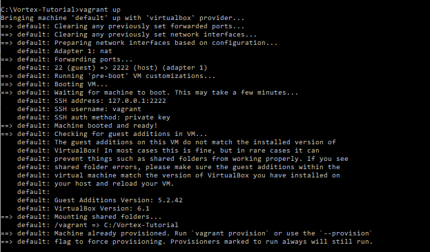
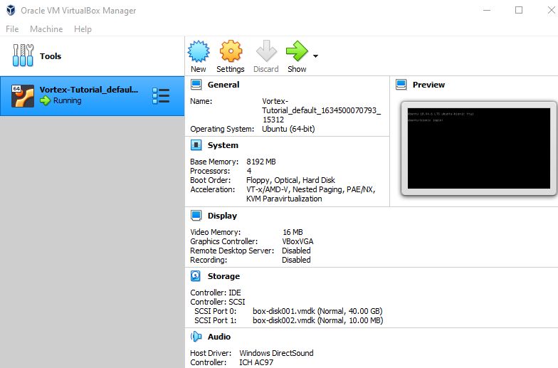

## Vortex Virtual Machine Instructions
For this tutorial, we provide access to a remote server with the tools as well as a virtual machine
image that contains the prebuilt version of the tools as well as the Vortex git repo. This VM is
built using Vagrant with a VirtualBox Provider, which means that it should be easy to run on most platforms.

We also provide the base Vagrantfile we use, although we note that setup may require some additional steps.
See "Building Vortex from Scratch" for more details on setting up a new VM and/or a base installation of the
tools.

### Important note for Apple Macbook M1 users
VirtualBox is not supported on M1 laptops and systems due to the switch from an x86 to aarch64 processor.
You can technically use a Vagrantfile with Docker, but we haven't tested this and can't confirm that it
works as expected. Success would depend on whether all the required packages can be installed for aarch64 
in the underlying Docker container. [Here](https://app.vagrantup.com/jeffnoxon/boxes/ubuntu-20.04-arm64) 
is one possible Vagrant setup that could be investigated if you are interested.


## VM Usage Instructions

**First** you will need to install [Vagrant](https://www.vagrantup.com) and [VirtualBox](https://www.virtualbox.com). We have tested
on Linux and Windows 10 with Vagrant 2.2.18 and VirtualBox 6.1.26.

For Linux (Ubuntu/Debian) users, Vagrant and VirtualBox can be installed using the following:

```
apt install vagrant virtualbox
```

### Vagrant set up and initialization

* [Vagrant Box with prebuilt toolchains and Vortex repo (2.5 GiB)](https://gatech.box.com/s/t36lnpzpvhn1ixvqlr8kj33btkt1q0us)
* [Vagrantfile - place in the same folder as your .box file](Vagrantfile)

#### Tutorial Setup - All Platforms
Once you have booted your VM from the instructions below, you should follow these steps to prepare for the hands-on portion of the tutorial:

* Source the `set_vortex_env.sh` script to set your paths
* Proceed to the Exercises section of this repo.

#### Setup

1) Download the Vortex Vagrant Box image ([from Box](https://gatech.box.com/s/t36lnpzpvhn1ixvqlr8kj33btkt1q0us)) to your computer
    * Create a directory to contain the files we need for Vagrant and move the vortex-ubuntu.box file there.
    * Note that the VM box image is **2.5 GiB**, and it requires **5 GiB of local disk space**.

2) Import the Vagrant Box image using the command-line
    * Run the commands from the directory created in step 1)

```
# We create a new local VM image from the vortex-ubuntu.box file and 
# then initialize a Vagrantfile with `vagrant init`

vagrant box add vortex-ubuntu.box --name vortex-micro55
vagrant init vortex-micro55
```

3) Download the Vagrantfile ([from this repo](Vagrantfile)) to your computer
    * Replace the Vagrantfile generated in the previous step.
    * The Vagrantfile includes some tweaks to disable serial adapters which can cause a boot error.
    * If you need to increase/decrease the number of cores used by the VM, you can also make this change in the Vagrantfile.
    * Create a directory named `vagrant-shared` in the same location for shared folder functionality. This folder will sync after ssh with the folder ~vagrant/vagrant-shared in the VM.

4) Boot the VM
```
vagrant up
```

Once it completes booting and returns back to the command prompt you can ssh into the VM.



```
vagrant ssh
```

3) When you are finished working with the VM, make sure to exit your session and run `vagrant halt` to power
the VM down. It is preferred to halt the VM with Vagrant than using the VirtualBox manager to power down the VM 
due to the additional setup steps that Vagrant performs.



Note that you can see and log into the VM using the VirtualBox Manager GUI. Just remember to start/stop the image with
Vagrant, if possible.


