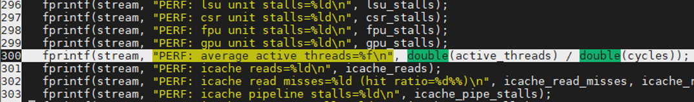

#assignment #1

In this assignment, you will be adding a new machine performance monitoring counter to calculate the average number of active threads per cycle during a program kernel execution. To help with the first assignment, we are providing template code. (please download the that has already a counter just to fill out the information. 
There are already a few performance counters supported in the hardware, you can see the list in “/Vortex/hw/rtl/VX_config.vh” (lines 158-215). You will be using the “CSR_MPM_ACTIVE_THREADS” and “CSR_MPM_ACTIVE_THREADS_H” counter slots to store your computed data. An easy place to calculate the current number of active threads is to use the instruction active thread mask ibuf_deq_if.tmask in the issue stage (see /Vortex/hw/rtl/VX_issue.v). An instruction is issued when both ibuf_deq_if.valid and ibuf_deq_if.ready are asserted. When an instruction is issued, you will have to count the total active bits in ibuf_deq_if.tmask to obtain the count for that cycle. Your change should alter the value of perf_active_threads. 

The active number of threads should be divided by the total number of cycles in “/Vortex/driver/common/vx_utils.cpp” and printed out (line 300). 

To test your change, you will be calling the software demo using the --perf command line argument: 

./ci/blackbox.sh --cores=4 --app=demo --perf 

The console output should show all the counters with the following line that reports your average active threads per cycle. 

PERF: average active threads=??? 

You will change the program workload to the following values 16, 32, 64, 128: 

./ci/blackbox.sh --cores=4 --app=demo --perf --args=”-n16” 

./ci/blackbox.sh --cores=4 --app=demo --perf --args=”-n32” 

./ci/blackbox.sh --cores=4 --app=demo --perf --args=”-n64” 

./ci/blackbox.sh --cores=4 --app=demo --perf --args=”-n128” 

Vortex Source Code Location: 

https://github.com/vortexgpgpu/vortex 

(Links to an external site.) 

 

Use the attached zip file which contains the template for this assignment: 

 

If you encounter a permissions error when trying to make, run the following command from the template directory: 

find . -type f \( -name "*.sh" -o -name "*.py" \) -exec chmod +x {} + 

#What to submit 
[1] PERF: ibuffer stalls values for 16, 32, 64, 128 cases. 
[2] Source code modifications 
 
#Solution: 

[1] (answers vary) 

-n16: 0.556489 

-n32: 0.758142 

-n64: 0.476399 

-n128: 0.508785 

 

[2] 

VX_issue.v 

vx_utils.cpp 
