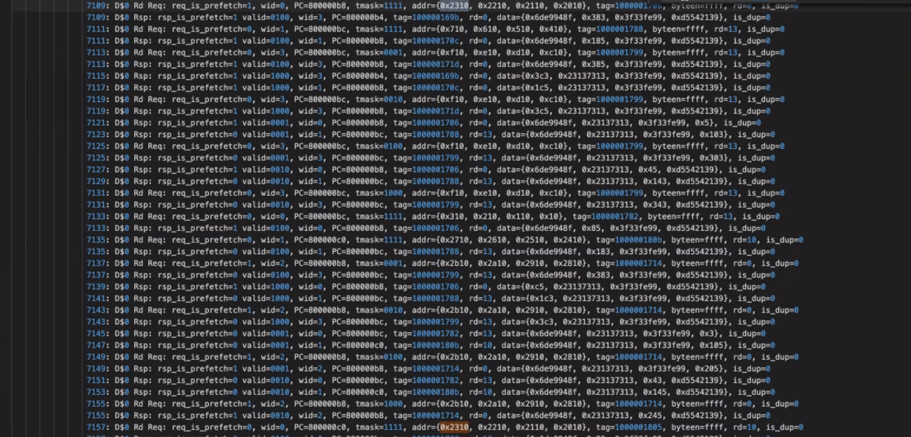

#Assignment #5: How to add a new instruction 

In this assignment, we will learn how to add a new instruction using intrinsics and by extending the pipeline. You are adding a software prefetch instruction. It's a new instruction, so we have to modify Sim-X, which is a functional simulator of Vortex before adding the new instruction in the pipeline (RTL programming). Since this is a new instruction that are not currently supported by RISC-V toolchains, we also have to insert the new instruction using assembly code. 

##Step 1: Adding a new intrinsic: 

- Check lines 10-13 in runtime/include/vx_intrinsics.h for an example of how a new intrinsic is added 

- The signature we’d like to use for the prefetch intrinsic would be like so:
  - inline void vx_prefetch (unsigned address)
- For new instructions whose opcode is not defined by RISC-V, the opcode used will be insn
- Pay attention to the following line. This needs to be modified for the prefetch 
intrinsic
```asm volatile (".insn s 0x6b, 1, %1, 0(%0)" :: "r"(num_warps), "r"(func_ptr));
```

 - The 1 after 0x6b is the identifier for the instruction. We have identifiers 0-4 already used so for the prefetch intrinsic, we can use identifier 5.
 - “r”(num_warps) is the argument passed to the intrinsic. For prefetch, we need an address (which is passed in as a register) so this part needs to be modified accordingly.
 
##Step 2: Defining a new instruction in simX: 
2a:  

- Check lines 178-185 in runtime/simX/decode.cpp 
  - GPGPU is the opcode for vortex RISC-V extensions
  - Add the case for the prefetch instruction using the identifier 5
2b:

- Check lines 908-914 in runtime/simX/execute.cpp for an example of how an instruction in simX is executed
  - We just want to print the prefetch address. So, this level of detail does not need to be incorporated for our case.
  - Pay attention to line 911. Rsdata is the register we need to access to get the prefetch address. Since the prefetch intrinsic only uses 1 register for the address, use rsdata[0] to get the address and print it within the case for the prefetch instruction

## Step 3: Extending pipeline/decoder
- Check lines 182-190 in in hw/rtl/VX_define.vh - add the opcode for prefetch
- Check lines 363-370 in hw/rtl/VX_decode.v 
  - The prefetch instruction would be similar to TMC since we are using 1 register only
 - For prefetch, the execution unit would be the LSU instead of the GPU. So, we need to add this to the case corresponding to prefetch before we write the other statements within this case:
``` ex_type = `EX_LSU; ``` 

## Step 4: Modifying the LSU to take in prefetch instructions
- Currently, the LSU (Load Store Unit) only takes in load and store instructions. To enable the LSU to take in prefetch instructions, we need to add a tag to indicate that an instruction is a prefetch. 
- All requests to the LSU come in through lsu_req_if. A tag should be added to this to indicate an instruction is a prefetch instruction. 
  - Follow the method used for the fence instruction to do this - search the codebase for all instances of fence to understand which files need to be modified to support prefetching
  - Be sure to check VX_instr_demux.v

## Step 5: Developing the test for checking whether prefetch works
- In tests/regression/fence, a test to check the fence instruction has been developed
- Duplicate this folder, rename it to prefetch, and modify the PROJECT=fence line inside the Makefile to PROJECT=prefetch
- Inside the for loop in kernel.c, add the following line: vx_prefetch(src0_ptr + offset + i); and use run.log to check whether this address is correctly prefetched
- To test your code, use ./ci/blackbox.sh --cores=4 --app=prefetch

## Step 6: Debuging guide 
### Debug Sim-X : 

 
### Debug RTL 
- Look at kernel.dump which shows the assembly code.

- Identify the prefetched instructions (0x800000b8) instruction is not decoded so it’s probably a prefetch intrinsic that you inserted. 

- In the debug log, search for 0x800000b8  PC address 

- And then search for the address in the addr={} e.g. 0x9d822409 

